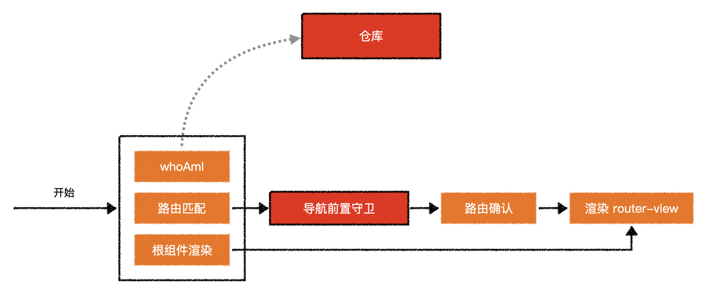
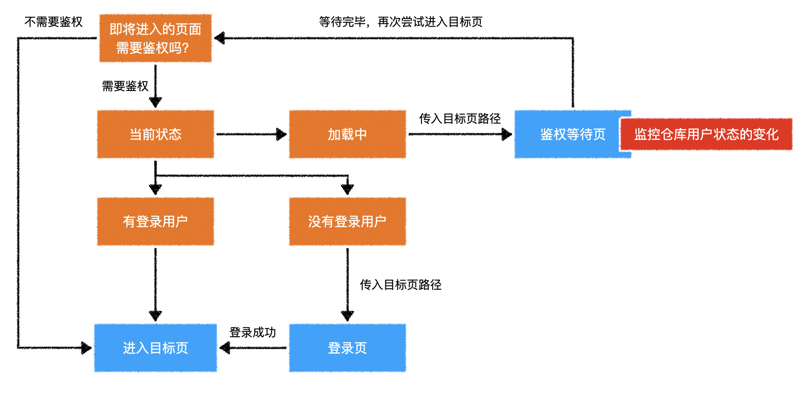

vuex 的经典案例

# 1，效果展示


# 2，路由总体示意图



# 3，鉴权守卫逻辑示意图



# 4，知识点

1. 登录
2. 恢复登录 `whoAmI`
3. 路由鉴权
4. 路由报错可以被 catch 到。

```js
this.$router.push().catch(() => {});
```

5. 监听 store

```js
this.$store.watch();
```
